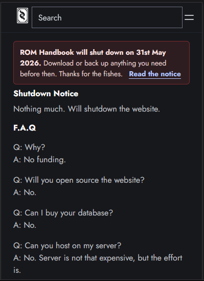

ROM Handbook, a popular resource for the game Ragnarok Online, is shutting down. To preserve the valuable information it contains, a crawler project has been initiated to extract and store the data before the shutdown. The crawler focuses on equipment data, formulas, and job information, saving it in a SQLite database. The project also takes raw HTML snapshots of the pages for archival purposes. This effort ensures that the wealth of knowledge from ROM Handbook remains accessible to the community even after the site goes offline.




----
# ROM Handbook Crawler

Crawler project for preserving ROM Handbook database before shutdown.

## Features

- Equipment crawler
- SQLite storage
- Formula extraction
- Jobs extraction
- Raw HTML snapshot

## Stack

- Python
- BeautifulSoup
- SQLite

## Setup

```bash
python -m venv venv
````

Activate venv:

Windows:

```bash
venv\Scripts\activate
```

Linux/Mac:

```bash
source venv/bin/activate
```

Install dependencies:

```bash
pip install -r requirements.txt
```

Run crawler:

```bash
python crawler-equipment.py
```
